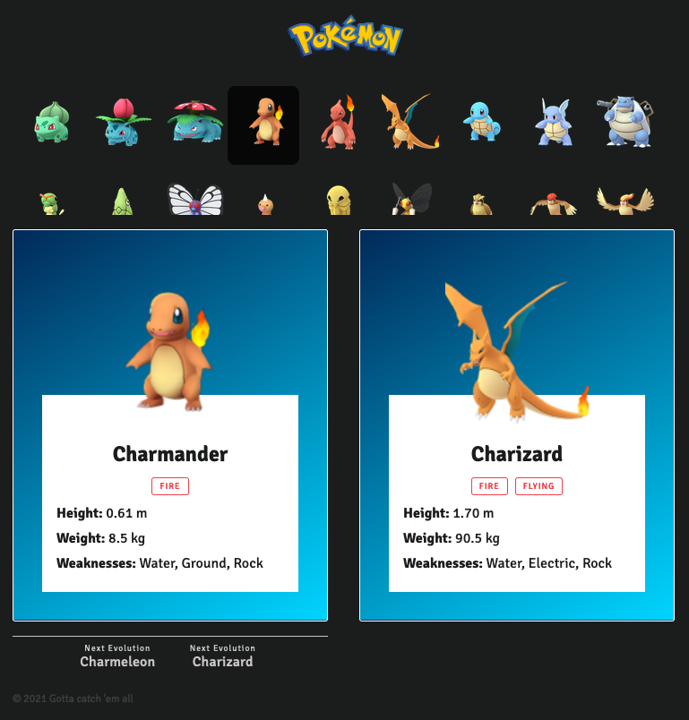

# Frontend Test

La duración de la prueba no debe ser superior a 4 horas.

## Objetivo

El objetivo de la prueba es valorar tu capacidad de desarrollar una SPA utilizando [Next.js](https://nextjs.org/).
Te hemos dejado una estructura básica ya montada para que no tengas que empezar de 0. En la carpeta src encontrarás:

* Una api ya desarrollada que proveé los datos de la página (**Spoiler Alert!**... va de Pokemons)
* Unos hooks de React que permiten obtener los datos de esa API
* Un ejemplo de uso de los hooks en el `index.tsx`

con esto de base deberás montar:

1. El listado de todos los Pokemon
2. El detalle de un Pokemon
3. Las evoluciones de ese Pokemon

Estos son los diseños que esperamos encontrar.

| Móvil | Tablet | Desktop |
|---|---|---|
|  |  |  |

Los settings y gráficos necesarios de la UI la podéis encontrar en `src`:

```
.
└── ui
    ├── svg
    │   └── *
    └── settings.ts
```

El funcionamiento deberá ser el siguiente:


## ¿Cómo empezar?

1. Hacer un repositorio nuevo utilizando este como base (sin hacer un fork).
2. Hacer al menos un primer commit con el código original, para ver la hora de inicio.
3. Hacer commits individuales por cada bloque que vayas haciendo. El último commit marca el final.
4. Envíanos el link a tu repositorio

## ¿Qué valoraremos?

* Simplicidad de la solución
* Organización y calidad de código
* Utilización de componentes modulares
* Mobile first y Responsive
* Uso de Git
* Web Performance Optimization
* Conocimientos de maquetación (HTML5 y CSS3)

## Bonus points

Si has cumplido todos los requisitos que valoramos, y te sobra tiempo puedes mejorar tu prueba ampliando con estos nuevos requisitos (recomendamos seguir el orden definido):

* Modifica las queries para utilizar GraphQL en lugar de Axios
* Tipos bien definidos con Typescript
* Testing unitario de componentes con Jest
* Testing E2E con Cypress
